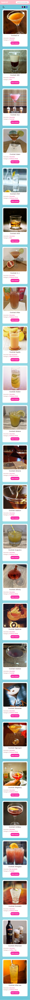
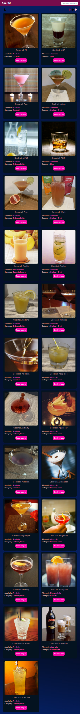
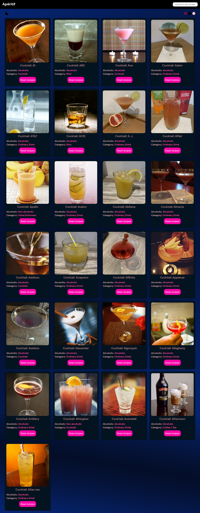

# Cocktail Recipes
# Personal Project - Cocktail recipes generator app solution

## Table of contents

- [Overview](#overview)
  - [The challenge](#the-challenge)
  - [Screenshot](#screenshot)
  - [Links](#links)
  - [Built with](#built-with)
  - [What I learned](#what-i-learned)
- [Author](#author)

## Overview

### The challenge

Users should be able to:

1. View the optimal layout for the app depending on their device's screen size
2. See hover states for all interactive elements on the page
3. Generate a new set of cocktail recipes by using search words
4. Generate the full details of the cocktail by clicking the read recipe button
5. Go back to the previous page when the back button is click in the recipes details page

### Screenshot

### Links

- Solution URL:(https://github.com/ibimina/cocktail-recipes)
- Live Site URL: (https://ibimina.github.io/cocktail-recipes/)

### Built with

- Reactjs
- CSS custom properties
- Flexbox
- Mobile-first workflow

### What I learned

How to fetch data using custom hooks in reactjs with Api 
How to use Context ,Reducers, and custom theme hook

## Author

- Ibimina Hart
- Frontend Mentor -[@ibimina](https://www.frontendmentor.io/profile/ibimina)
- Twitter - [@ibiminaaH](https://www.twitter.com/ibiminaaH)
- Linkedin - [@ibimina](https://www.linkedin.com/in/ibimina-hart/)

